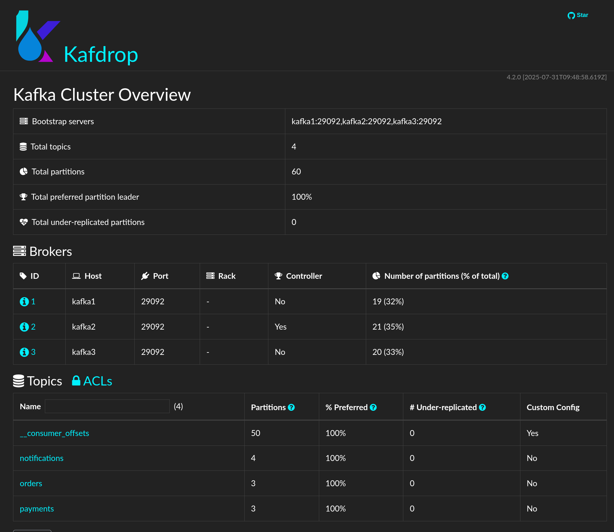
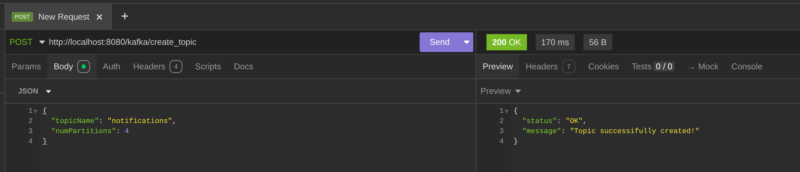
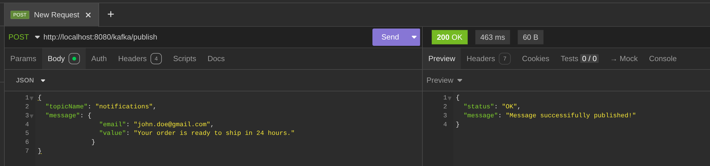

# A Multi-Node Apache Kafka Cluster in Docker and Node.js for Microservices
### How to get started with Kafka, NodeJS & ExpressJS
- Clone the repository
- Install dependencies
- Install a single node kafka cluster by typing ```docker compose up -d``` 
- View and manage your Kafka cluster with Kafdrop by visiting ```http://localhost:19000```
- Start a backend server by typing ```npm start```
- Use Postman or any similar tool to send requests to ```http://localhost:8080```
- To create a new topic, send a POST request to ```http://localhost:8080/kafka/create_topic``` with payload
  `{"topicName": "any_topic_name", "numPartitions": "any_number"}`
- To publish a message to a topic, send a POST request to ```http://localhost:8080/kafka/publish``` with payload
  `{
      "topicName": "existing_topic",
      "message": {
                    "key": "my_key",
                    "value": "message_content"
      }
  }`
- To consume a topic message, send a POST request to ```http://localhost:8080/kafka/consume``` with payload ```{"topicName": "your_topic_name"}```
- Have fun

<br />

### Available Kafka Topics with Partitions


### Creating a Kafka Topic


### Publishing to a Topic


